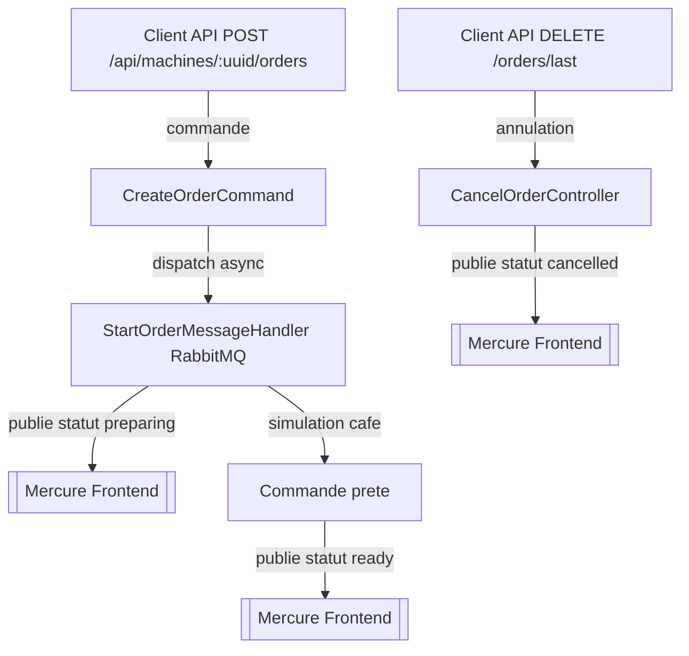

# 🧱 Documentation d’Architecture — Machine à Café Connectée

## 🎯 Objectif du projet

Ce projet simule une machine à café connectée permettant :

- de passer des commandes de café
- de suivre leur progression en temps réel
- et de gérer les statuts métier (préparation, prêt, annulation)

Ce projet met en œuvre une architecture moderne (DDD, CQRS, messaging async) appliquée à un cas concret de pilotage d’équipement connecté en temps réel.

---

## 🧰 Stack technique


| Côté        | Technologie              | Usage                                  |
|-------------|--------------------------|----------------------------------------|
| Back-end    | Symfony 6.4              | API REST et logique métier             |
| Bus         | Messenger + RabbitMQ     | Commandes asynchrones                  |
| Auth        | JWT                      | Sécurisation de l'API                  |
| DDD         | Domain/UseCase/Infra     | Organisation métier                    |
| Real-time   | Mercure                  | Publication des événements             |
| Front-end   | Next.js                  | UI React avec EventSource              |
| Docker      | PHP, RabbitMQ, DB, Mercure | Environnement unifié                 |
| Tests       | PHPUnit                  | Tests fonctionnels                     |
| Qualité     | PHPStan (niveau 9)       | Analyse statique stricte               |
| Formatage   | PHP-CS-Fixer             | Convention de style automatisée        |


---

## 🧠 Architecture choisie

### 1. DDD — Domain Driven Design

Organisation du code :
- `Domain`: entités, value objects, services métier, interfaces
- `Application`: cas d’usage (commands / queries)
- `Infrastructure`: contrôleurs, repositories concrets, adaptateurs, événements

### 2. CQRS — Command Query Responsibility Segregation

Séparation stricte :
- Commandes → mutation des données (CreateOrderCommand, CancelOrderCommand)
- Requêtes → lecture pure (GetMachineQuery)

### 3. Traitement asynchrone avec Messenger et Workers

Certaines actions, comme la préparation d’un café, nécessitent un traitement différé.  
Plutôt que de bloquer l’utilisateur ou d’implémenter une attente côté front, ce projet s’appuie sur un modèle **asynchrone** à l’aide du **composant Messenger de Symfony**.

#### 🔄 Fonctionnement

- Lorsqu’une commande est passée, un objet `StartOrderMessage` est dispatché.
- Celui-ci est routé vers un **transport asynchrone** (ici RabbitMQ).
- Un **worker Symfony** écoute cette file et traite les messages un à un :

```bash
php bin/console messenger:consume async
```

### 4. Publication directe avec Mercure (sans événements Symfony)

Ce projet n'utilise pas le système `EventDispatcher` de Symfony.  
À la place, les statuts de commande (`preparing`, `ready`, `cancelled`) sont publiés **directement** via Mercure :

- Dans les `MessageHandler` asynchrones pour les commandes (ex : `StartOrderMessageHandler`)
- Dans les `Controller` synchrones (ex : `CancelOrderController`)

Cela simplifie la logique en évitant des couches d’événements métier tout en assurant la réactivité côté front grâce au **protocole Mercure**.

---

## 🔁 Cycle de vie d’une commande



---

## 🧪 Tests

- Tests fonctionnels et unitaire sur l’API
- Objectif : valider le cycle complet de commande

---

## 🔐 Sécurité

- Authentification via JWT
- Accès API conditionné au token JWT

---

## 📦 Déploiement & Docker

- Docker compose pour PHP + DB + RabbitMQ + Mercure + phpMyAdmin
- Lancement global via :

```bash
castor up
```

---

## 🎥 Front-end

- Réalisé en Next.js
- API consommée en REST
- Statuts affichés en direct via EventSource (Mercure)
- Interface utilisateur simple et interactive

---

### 📡 API REST disponible

| Méthode | URL | Description |
|--------|-----|-------------|
| `GET` | `/api/machine` | Récupère l’UUID de la machine à café |
| `GET` | `/api/machines/{uuid}/orders` | Liste les commandes passées pour une machine donnée |
| `POST` | `/api/machines/{uuid}/orders` | Crée une nouvelle commande de café |
| `DELETE` | `/api/machines/{uuid}/orders/last` | Annule la dernière commande si elle est en cours |
| `POST` | `/api/login_check` | Authentification via JWT |

> 🔐 Les routes de commande nécessitent un **token JWT valide** dans l’en-tête `Authorization`.
